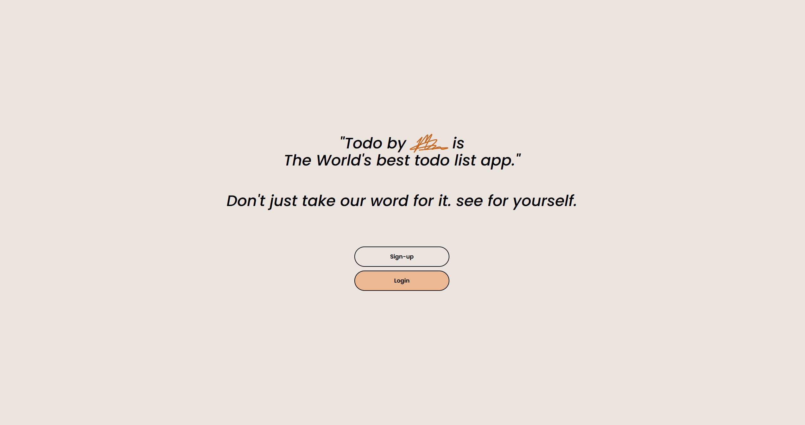
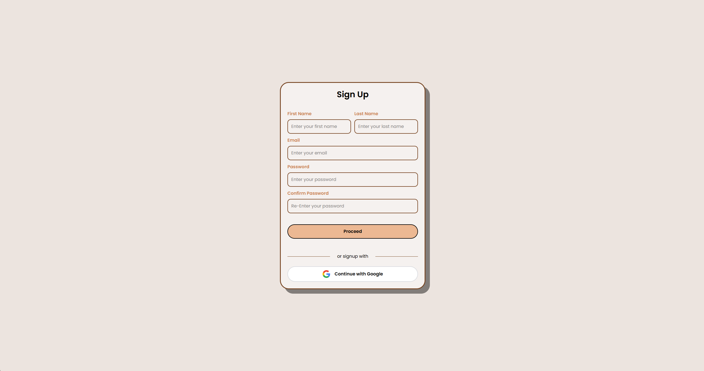
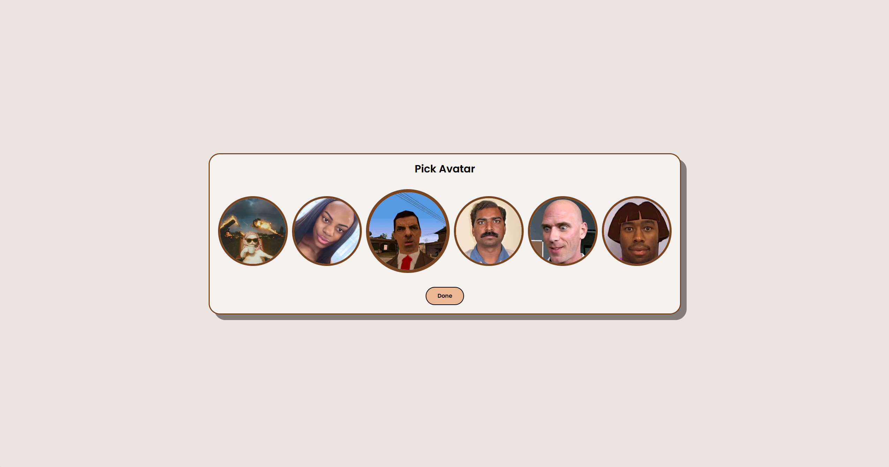
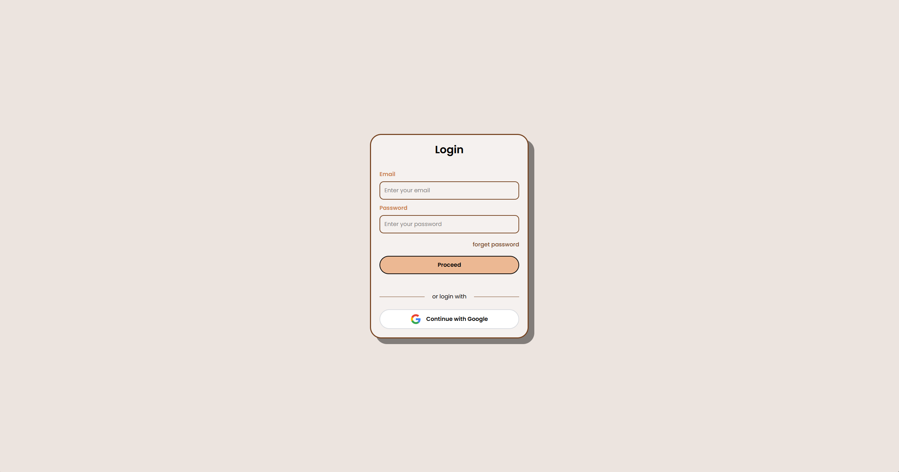
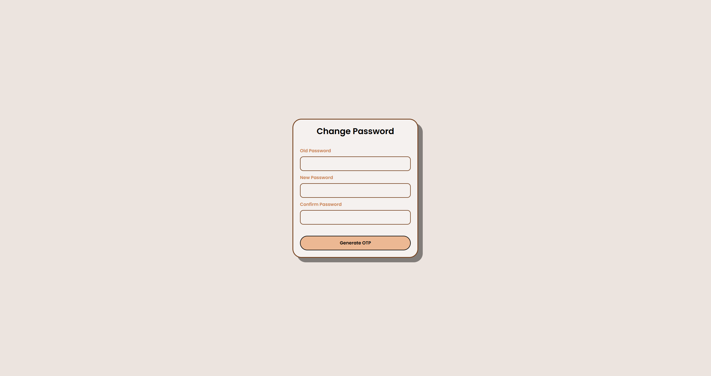
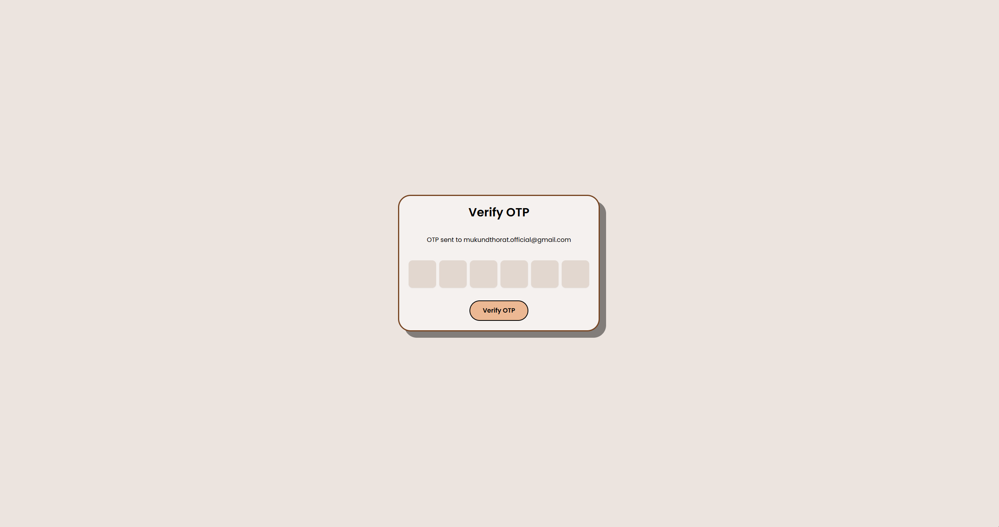
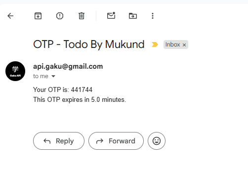
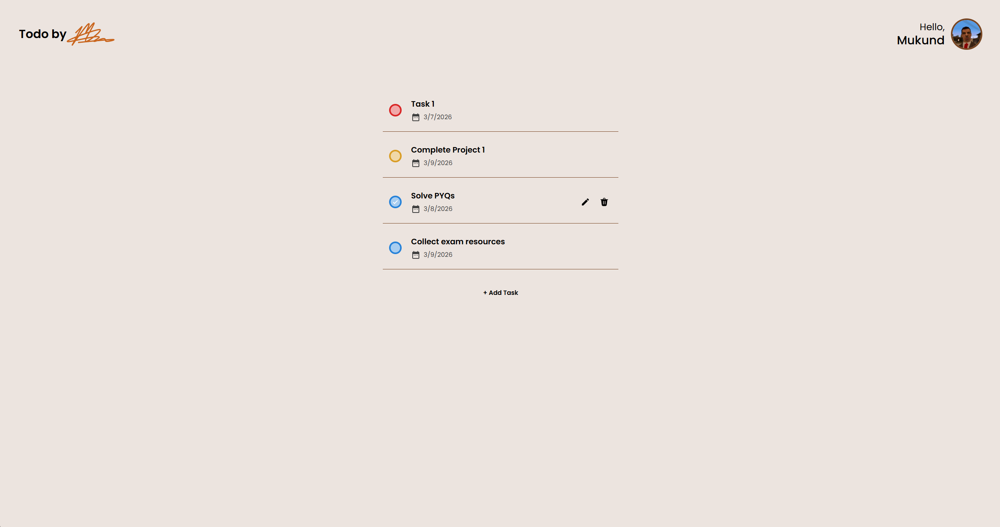
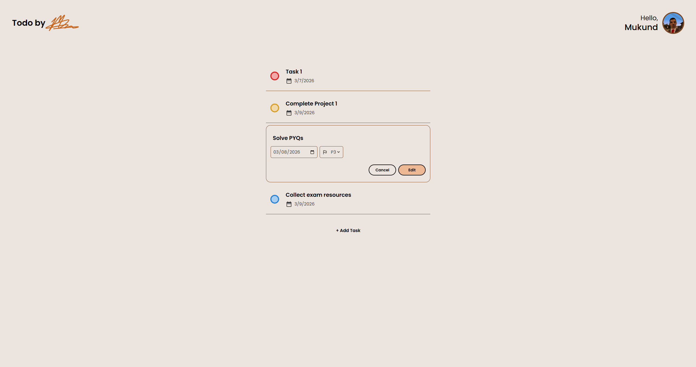

# 📝 Todo by Mukund
> A clean, production-ready starter template for building full-stack apps with **FastAPI + Postgres SQL**, featuring secure authentication, user management, and a simple Todo module. Includes both backend APIs and a server-rendered web UI.

## 🚀 Features

-   ⚡ High-performance FastAPI backend with Postgres SQL
-   🔐 Secure JWT authentication with refresh token cookies (OAuth2 password flow)
-   📧 Email OTP flows:
    -   Login verification
    -   Password changes
    -   Password recovery
    -   Account deletion
-   🌐 Google OAuth login
-   🛡️ Rate limiting on API routes using SlowAPI
-   🧾 Request ID middleware + structured error responses
-   🪵 Centralized backend logging for debugging and monitoring
-   🖼️ React + Vite + Typescript frontend
-   ⛔ Built with Zod, Tanstack Query, Tailwind CSS and Redux Toolkit
-   ✅ Todo CRUD endpoints

## 📷 Gallery
### 1. Welcome Screen

### 2. Sign Up

### 3. Avatar

### 4. Log In

### 5. Forget Password

### 6. OTP Verification


### 7. App / Dashboard



## ⚡ Quick Start
- Run the project on your machine using Docker

This method runs the entire stack using Docker:
- FastAPI backend
- React frontend
- PostgreSQL database
- Redis

Everything starts with a single command.

#### 1️⃣ Create your env file

```bash
copy .example.env .env
```
#### 2️⃣ Build the image
```bash
docker compose up --build
```
This will start:
-   Backend (FastAPI) on port 8000
-   Frontend (React + Vite + TypeScript) on port 5173
-   PostgreSQL on port 5432
-   Redis on port 6379

🌍 Open:
-   App → [http://localhost:8000/](http://localhost:8000/)
-   Docs → [http://localhost:8000/docs](http://localhost:8000/docs)
-   Frontend → [http://localhost:5173/](http://localhost:5173/)
## 🔌 API Overview
### 🔐 Auth
-   `POST /auth/login`
-   `POST /auth/register`
-   `GET /auth/refresh`
-   `GET /auth/logout`
-   `POST /auth/otp/request`
-   `POST /auth/otp/verify`
-   `GET /auth/google/login`
-   `GET /auth/google/callback`
### 🔑 Password Recovery
-   `GET /auth/recovery/otp/request`
-   `POST /auth/recovery/otp/verify`
-   `POST /auth/recovery/change_password`
### 👤 User
-   `GET /user/email`
-   `POST /user/change_password/verify_password`
-   `POST /user/change_password/otp/verify`
-   `POST /user/delete_account/verify_password`
-   `POST /user/delete_account/otp/verify`
### 📝 Todos
-   `GET /todos/active`
-   `GET /todos/inactive`
-   `POST /todos/create`
 -   `PUT /todos/update_title/{todo_id}`
 -   `PUT /todos/update_status/{todo_id}`
 -   `DELETE /todos/remove/{todo_id}`

## 🔐 License
MIT License — see [License](../LICENSE) for details.