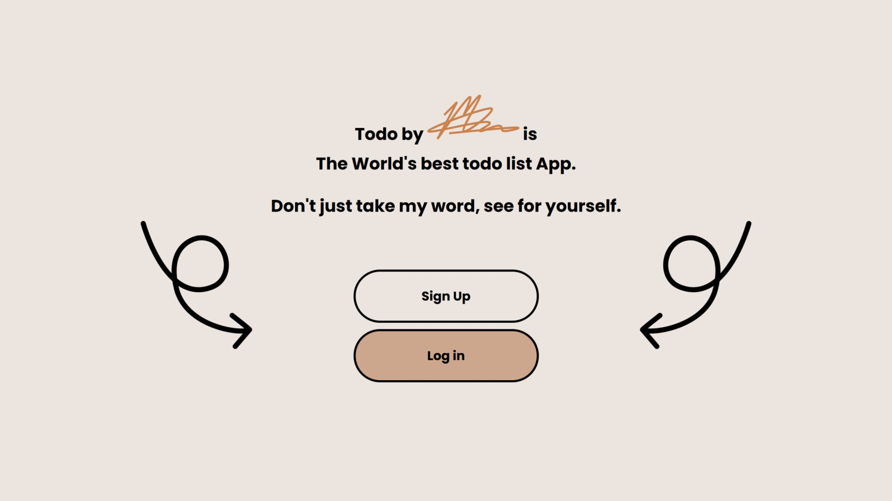
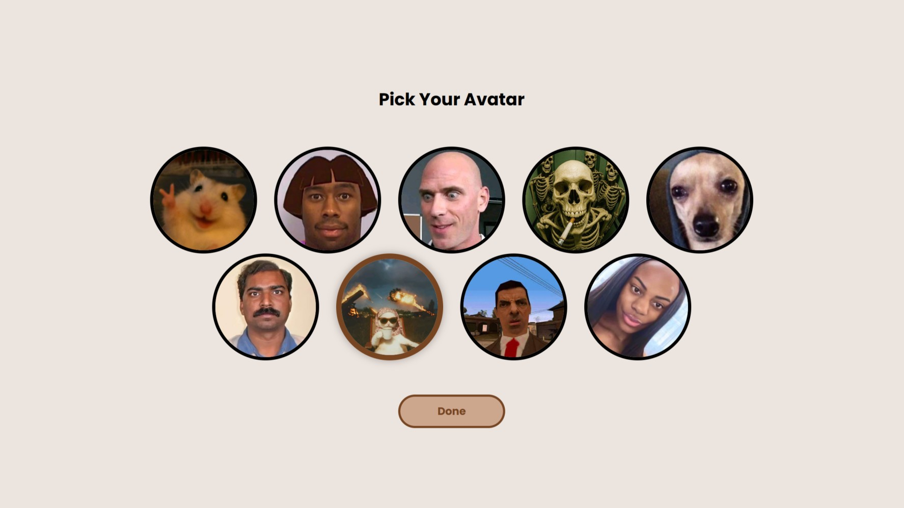
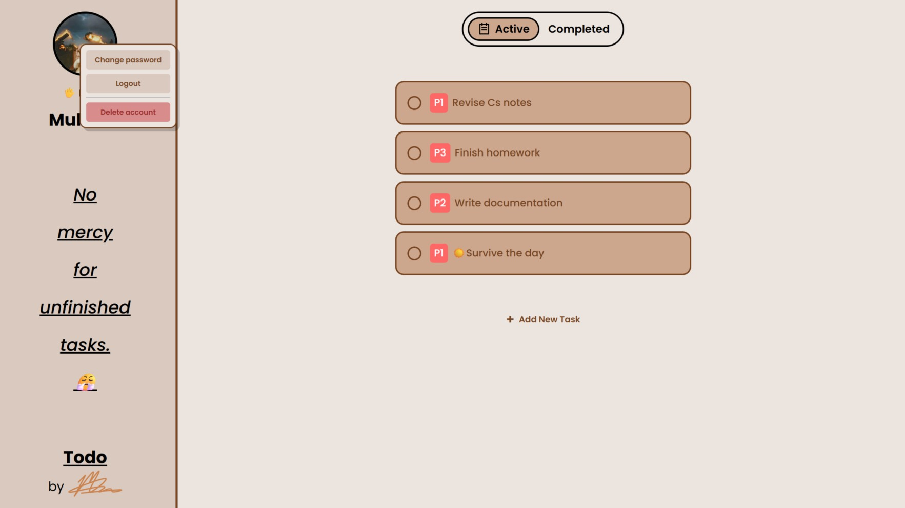
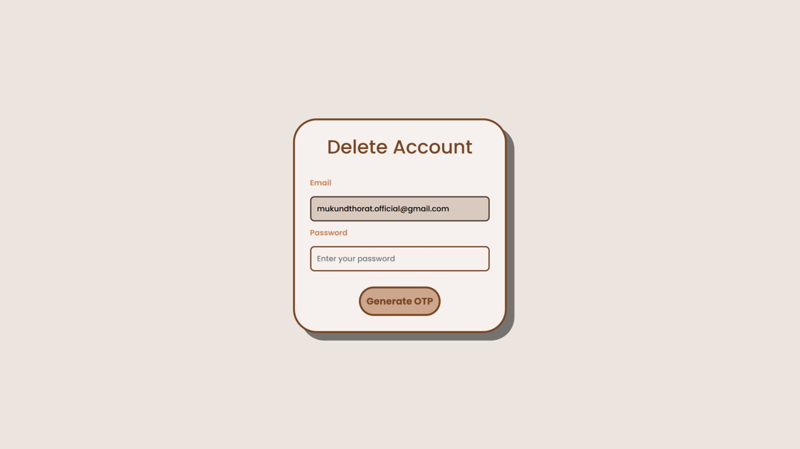
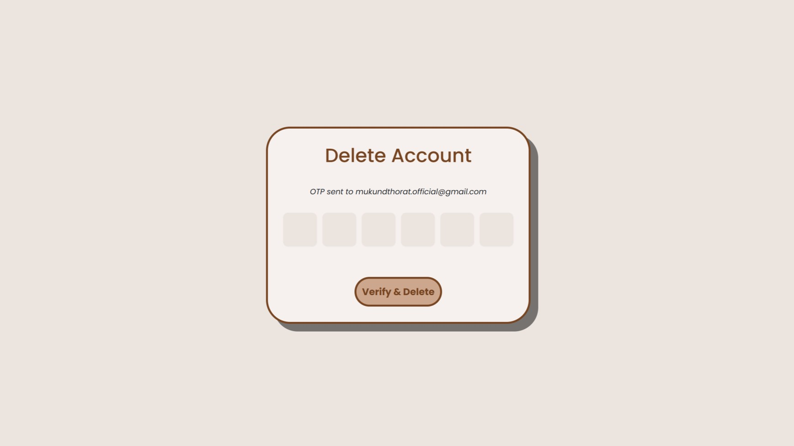

# 📝 Todo by Mukund
> A clean, production-ready starter template for building full-stack apps with **FastAPI + MongoDB**, featuring secure authentication, user management, and a simple Todo module. Includes both backend APIs and a server-rendered web UI.

## 🚀 Features

-   ⚡ High-performance FastAPI backend with async MongoDB (Motor)
-   🔐 Secure JWT authentication with refresh token cookies (OAuth2 password flow)
-   📧 Email OTP flows:
    -   Login verification
    -   Password changes
    -   Password recovery
    -   Account deletion
-   🌐 Google OAuth login
-   🛡️ Rate limiting on API routes using SlowAPI
-   🧾 Request ID middleware + structured error responses
-   🪵 Centralized backend logging for debugging and monitoring
-   🖼️ Jinja2 templates + static frontend (`frontend/`)
-   ✅ Todo CRUD endpoints

## 📷 Gallery
### 1. Welcome Screen

### 2. Sign Up

### 3. Avatar

### 4. Log In

### 5. Forget Password

### 6. App / Dashboard

### 7. Delete Account

### 8. OTP Verification


## ⚡ Quick Start
Choose one of the following methods:
### 🧰 Method 1: Manual (using `uv`)
#### 1️⃣ Install `uv`
```bash
pip install uv
# or
pipx install uv
```
#### 2️⃣ Create virtual environment & install dependencies
```bash
cd backend
python -m venv .venv
.venv\Scripts\activate
uv sync
```
#### 3️⃣ Configure environment variables
```bash
cd ..
copy .example.env .env
```
Edit `.env` with the following values:
-   `MONGO_URI` _(required)_
-   `SECRET_KEY` _(required for JWT + sessions)_
-   `ALGORITHM` _(e.g. HS256)_
-   `SMTP_EMAIL` / `SMTP_PASS` _(required for OTP email flows)_
-   `GOOGLE_CLIENT_ID` / `GOOGLE_CLIENT_SECRET` / `GOOGLE_REDIRECT_URI` _(optional, for Google OAuth)_
#### 4️⃣ Run the app
```bash
uvicorn backend.main:app --reload
```
🌍 Open:
-   App UI → [http://localhost:8000/](http://localhost:8000/)
-   API Docs → [http://localhost:8000/docs](http://localhost:8000/docs)
    

----------

### 🐳 Method 2: Docker

#### 1️⃣ Create your env file

```bash
copy .example.env .env
```
#### 2️⃣ Build the image
```bash
docker build -t todobymukund .
```
#### 3️⃣ Run the container
```bash
docker run --rm -p 8000:8000 --env-file .env todobymukund
```
🌍 Open:
-   App → [http://localhost:8000/](http://localhost:8000/)
-   Docs → [http://localhost:8000/docs](http://localhost:8000/docs)
## 🔌 API Overview
### 🔐 Auth
-   `POST /auth/login`
-   `POST /auth/register`
-   `GET /auth/refresh`
-   `GET /auth/logout`
-   `POST /auth/otp/request`
-   `POST /auth/otp/verify`
-   `GET /auth/google/login`
-   `GET /auth/google/callback`
### 🔑 Password Recovery
-   `GET /auth/recovery/otp/request`
-   `POST /auth/recovery/otp/verify`
-   `POST /auth/recovery/change_password`
### 👤 User
-   `GET /user/email`
-   `POST /user/change_password/verify_password`
-   `POST /user/change_password/otp/verify`
-   `POST /user/delete_account/verify_password`
-   `POST /user/delete_account/otp/verify`
### 📝 Todos
-   `GET /todos/active`
-   `GET /todos/inactive`
-   `POST /todos/create`
 -   `PUT /todos/update_title/{todo_id}`
 -   `PUT /todos/update_status/{todo_id}`
 -   `DELETE /todos/remove/{todo_id}`
## 🗂️ Project Structure
```text
backend/    → FastAPI app, routers, data access, utilities
frontend/   → Jinja2 templates + static assets
.example.env → Environment variable template
```
## 🔐 License
MIT License — see [License](./LICENSE) for details.